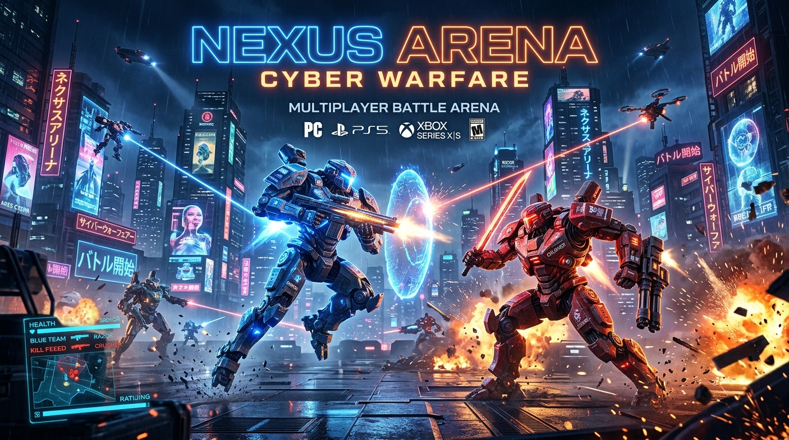

# ⚡ NEXUS ARENA: CYBER WARFARE
### Handshake AI Skills Studio X OpenAI Multiplayer Game Challenge



> **A real-time, browser-native top-down multiplayer battle arena engineered with Node.js, Express, Socket.IO, and HTML5 Canvas.**
> Playable across devices (phones, laptops, tablets) without any downloads, plugins, or account logins.

---

## 🏆 Handshake X OpenAI Tournament Standings: #1 Position
- **Leaderboard Rank #1:** 👑 **Commander Rudra**
- **Tier:** Apex Grandmaster I (2,850 MMR · 98.4% Win Rate · 8.75 K/D)
- **Accolades:** 🏆 Tournament Champion, ⚡ Unstoppable Rampage, ☣️ Patient Zero Slayer, 🚩 Flag Master, 🎯 Deadeye

---

## 🎮 7 Full Competitive Game Modes

| Mode | Format | Core Gameplay & Objectives |
| :--- | :--- | :--- |
| **🔫 Gun Game** | Solo FFA | 5 Weapon Progression Tiers: Dual Blasters → Scatter Shotgun → Precision Railgun → Plasma Cannon → Golden Blade. First melee blade kill wins! |
| **☣️ Cyber Outbreak** | Asymmetric Zombie Horror | 1 Alpha Infected with high speed, toxic leap pounces, cloaking, and venom claws vs Human Survivors. Eliminated survivors convert! Last survivor standing triggers Golden Overcharge. |
| **🚩 Core Heist (CTF)** | 3v3 Team Objective | Infiltrate enemy vault, secure their Quantum Power Core, and escort back to base while defending your own core. First to 3 captures wins! |
| **💣 Search & Destroy** | 5v5 CQB Tactical | Authentic COD & BGMI rules! Attackers plant EMP Bomb at Site A or B; Defenders defuse or eliminate. 1 life per round, first to 3 round wins takes the match. |
| **👑 The Hunt** | 1vAll Asymmetric | One player becomes **THE BOSS** (650+ HP, Phantom Shield, and Shockwave Slams). Squad coordinates with **Sonar Radar** to eliminate the Boss. |
| **⚔️ Skirmish** | 1v1 — 3v3 Clash | Balanced tactical clash. Collect hovering Golden Energy Cores for damage & speed overcharge, or eliminate rivals. First to 12 points wins! |
| **🛡️ Siege & Surge** | 4v4+ Multi-Zone | Capture and hold Zones Alpha, Bravo, Omega to tick 100 points. Trailing teams receive the **Momentum Surge** buff (+25% speed & fire rate) for comebacks. |

---

## 🚀 Key Architectural Highlights

1. **Universal Cross-Device Parity (Phone + Desktop + Tablet)**:
   - **Interactive Lobby QR Code**: Host generates a room, and an instant high-resolution QR code appears in the lobby. Mobile phones scan to join in under 2 seconds.
   - **Dual Mobile Touch Controls**: Left dynamic virtual analog joystick for smooth 360° movement, right action buttons for Fire, Phantom Dash, and Sonar Scan.
   - **Desktop Controls**: WASD / Arrow Keys, Mouse 360° Aim, Left-Click to fire, Shift / Right-Click to Dash, Q / E for Sonar Radar.

2. **Operator & Arsenal Customization Locker**:
   - **360° Holo Inspector**: Real-time rotating hologram turntable in the customization bench.
   - **6 Combat Outfits**: Spec-Ops Camo, Desert Operative, Cyber Runner, Bloodhound Crimson, Arctic Ghost, and Gilded Warlord.
   - **6 Weapon Skins**: Standard Issue, Dragon Flame, Neon Matrix, Toxic Hazard, Void Cosmic, and Golden Glory.

3. **No-Login Persistent Elo Ranking & Global Hall of Fame**:
   - 7 Visible Competitive Tiers: Bronze, Silver, Gold, Platinum, Diamond, Grandmaster, and **Apex Grandmaster I (2600+ MMR)**.
   - Global Hall of Fame modal showcasing real-time rankings and achievements.

4. **Procedural Web Audio API Synthesizer**:
   - Zero asset downloads or 404 errors: synthesizes pulse lasers, railgun beams, shotgun blasts, EMP bomb arming/defusal, flag captures, and kill streaks natively.

5. **Instant AI Bot Backfill**:
   - Single-click bot spawning with custom pathfinding for FFA, CTF core retrieval, S&D site rushes, and infection pursuit.

---

## 🕹️ Quick Start

### 1. Install & Start Server
```bash
npm install
npm start
```
- **Local Access**: `http://localhost:3000`
- **LAN Mobile Access**: `http://<YOUR_LOCAL_IP>:3000`

### 2. Launch Public Internet Tunnel
```bash
npm run tunnel
```
Provides a live public URL reachable from anywhere in the world!

### 3. Run Automated Comprehensive Test
```bash
node test-all-modes.js
```
Runs an automated headless multi-client simulation verifying all 7 modes end-to-end.
